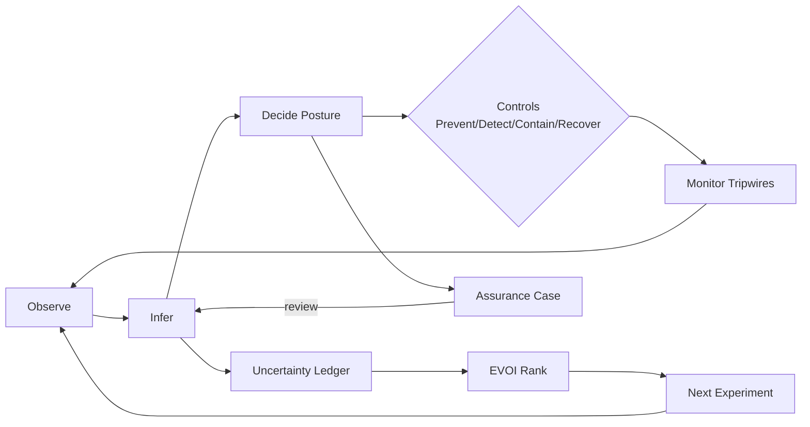
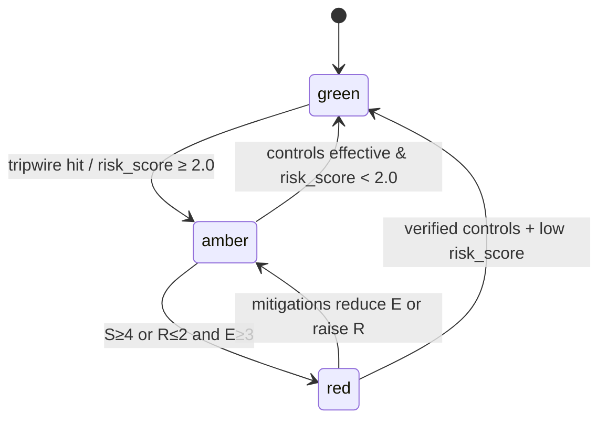

# lousa-assurance

Engineering interface for AI safety assurance: typed Risk Notes, posture logic, GSN generation, and EVOI-driven investigations that turn skepticism into decisions.

---

## Why this exists

Safety shouldn’t be a vibe. This repo makes safety communication auditable and reproducible by defining a typed **Risk Note** artifact, default **posture rules** with asymmetric weighting, and a small CLI that lints, checks evidence freshness, emits **assurance-case** views, prioritizes investigations by **EVOI**, and enforces **release gates**.

---

## Quick start

```bash
# 1) Create and activate a virtual environment (recommended)
python3 -m venv .venv && source .venv/bin/activate

# 2) Install runtime deps
pip install PyYAML jsonschema

# 3) Lint a Risk Note against the schema
./safety_protocol.py lint examples/risk-note-47.yaml --schema risk_note.schema.json

# 4) Check evidence freshness (fails CI if stale)
./safety_protocol.py check-evidence examples/risk-note-47.yaml --max-age P30D

# 5) Generate a lightweight GSN-style view
./safety_protocol.py generate-assurance-case examples/risk-note-47.yaml > case.gsn.txt

# 6) Rank investigations by EVOI per hour within a budget
./safety_protocol.py prioritize ./examples --budget PT40H

# 7) Enforce posture at release time
./safety_protocol.py gate-check examples/risk-note-47.yaml --posture green
```

---

## Repository layout

```
risk_note.schema.json      # JSON Schema (Draft 2020-12) for Risk Note v1.0
safety_protocol.py         # CLI: lint, check-evidence, generate-assurance-case, prioritize, gate-check
calculate_posture.py       # Default posture function (S×E×R with asymmetric dominance)
examples/
  risk-note-47.yaml        # Example Risk Note instance
```

---

## The operating loop (at a glance)



---

## Risk Note v1.0 schema

Machine-checkable contract for safety claims, evidence, uncertainty, posture, controls, and the next experiment. The JSON Schema enforces structure, types, ranges, enums, and ISO-8601 durations.

```yaml
# examples/risk-note-47.yaml (excerpt)
risk_note:
  identity:
    id: "Claim-47"
    version: "1.3.0"
    created: "2025-08-20T10:00:00Z"
    author: "Safety Lead <safety@example.org>"
  scope:
    operating_conditions: "Server-side inference; autoscaling; EU+US; no tool-use."
    input_distribution: "EN consumer queries; 70% chit-chat, 20% tasks, 10% adversarial probes."
    temporal_validity: "P30D"
  claim:
    hazard_class: "AdversarialManipulation"
    threshold: 0.02
    credible_interval: [0.008, 0.018]
    shift_budget: 0.05
    failure_criteria:
      - "Red-team success rate > threshold"
  evidence:
    sources:
      - id: "E-102"
        title: "Red-team Round 2"
        uri: "artifact://experiments/redteam_round2.jsonl"
        type: "experiment"
        created: "2025-08-18T16:30:00Z"
    methodology: "10k adversarial prompts; stratified; blinded grading; Wilson CI."
  uncertainty:
    entries:
      - id: "U-1"
        type: "epistemic"
        location: "model"
        contribution: 0.35
        description: "Unknown robustness to novel injection style."
  triage:
    severity: 4
    exploitability: 3
    reversibility: 2
    posture: "red"
  controls:
    prevent:
      - id: "C-P-1"
        description: "Prompt hardening rules for tool mentions"
        owner: "NLP Eng"
        status: "implemented"
  next_investigation:
    experiment: "Generate-and-test T-7 injection family (1k cases)"
    evoi_score: 0.62
    resource_estimate: "PT16H"
```

Validate it:

```bash
./safety_protocol.py lint examples/risk-note-47.yaml --schema risk_note.schema.json
```

---

## Posture logic

The default **asymmetric** rule lets very high severity or low reversibility dominate at moderate exploitability; otherwise a simple risk matrix applies.

```python
# calculate_posture.py (core)
def calculate_posture(severity, exploitability, reversibility):
    if severity >= 4 or reversibility <= 2:
        if exploitability >= 3: return "red"
        elif exploitability >= 2: return "amber"
    risk_score = (severity * exploitability) / max(reversibility, 1e-9)
    if risk_score >= 4.0: return "red"
    elif risk_score >= 2.0: return "amber"
    return "green"
```

Visualized:



---

## From Risk Note to Assurance Case

Generate a compact, human-reviewable argument skeleton directly from the typed note.

```bash
./safety_protocol.py generate-assurance-case examples/risk-note-47.yaml
```

A GSN-ish view:

```mermaid
graph TD
  G0[Goal: Safety claim Claim-47 v1.3.0] --> S1[Strategy: Obs–Inf–Dec + defeasible claim]
  S1 --> Cx[Context: Scope, Dist, Validity, Shift Budget]
  S1 --> E1[Solution: Evidence set E-102, ...]
  S1 --> A1[Assumption: Model-to-world mapping & thresholds]
  S1 --> U1[Sub-Goal: Uncertainty ledger entries + contribution]
  S1 --> T1[Sub-Goal: Triage S×E×R → Posture]
  S1 --> N1[Solution: Next experiment (EVOI-ranked) to move decision boundary]
```

---

## Evidence freshness in CI

Evidence ages; confidence rots. Fail the build when sources exceed your staleness policy.

```bash
./safety_protocol.py check-evidence examples/risk-note-47.yaml --max-age P30D
```

---

## Prioritize the next experiment by EVOI

Keep attention disciplined: pick the experiment most likely to change the decision per unit time.

```bash
./safety_protocol.py prioritize examples/ --budget PT40H
```

---

## Design principles

Treat safety communication as an interface, not an aesthetic. Separate observation, inference, and decision; make claims versioned, scoped, and defeasible; track uncertainty as a ledger with location and contribution; tie every weakness to a control class; use triage to set posture; precommit tripwires; calibrate the humans; and let expected value of information pick the next move.

---

## Contributing

Propose schema changes as PRs with:
1) a JSON Schema diff,  
2) a minimal example YAML exercising new fields, and  
3) CLI updates plus tests that fail without the change.

---

## License

Unless otherwise noted, all code, schemas, and tooling in this repository are licensed under the **Apache License, Version 2.0**. This choice keeps the license permissive while adding an explicit patent grant and patent-retaliation protection—important for assurance tooling that may intersect with patented methods.

See the full text in [`LICENSE`](LICENSE).

### SPDX header (add to source files)

```python
# SPDX-License-Identifier: Apache-2.0
```

```yaml
# SPDX-License-Identifier: Apache-2.0
```

### Standard header (optional, for files that use full headers)

```
Copyright (c) 2025 Lousa Assurance contributors

Licensed under the Apache License, Version 2.0 (the "License");
you may not use this file except in compliance with the License.
You may obtain a copy of the License at

    https://www.apache.org/licenses/LICENSE-2.0

Unless required by applicable law or agreed to in writing, software
distributed under the License is distributed on an "AS IS" BASIS,
WITHOUT WARRANTIES OR CONDITIONS OF ANY KIND, either express or implied.
See the License for the specific language governing permissions and
limitations under the License.
```

### NOTICE file (place at repo root as `NOTICE`)

```
lousa-assurance
Copyright (c) 2025 Lousa Assurance contributors

This product includes software developed by the lousa-assurance project.
Portions may include third-party components; see the source files and
attribution in this NOTICE for details.
```

### Third-party attributions

If you bundle third-party code, keep their original license headers and add a short note under `NOTICE` (or in `THIRD_PARTY_NOTICES`) identifying the component, version, and license.
