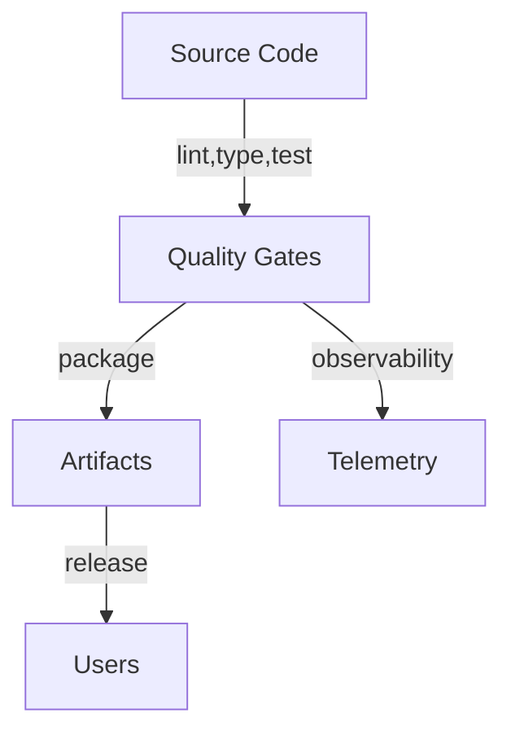

<!-- SPDX-License-Identifier: MPL-2.0 -->
# 0001: Repository Standardization Baseline

- Status: Accepted
- Deciders: Core maintainers
- Date: 2024-05-20

## Context and Problem Statement

The repository previously lacked a consistent developer experience, standardized
quality gates, and shared tooling across environments. This impeded
contributions, automation, and long-term maintainability.

## Decision Drivers

- Reproducible local and CI environments
- Enforced quality bars for linting, typing, testing, and security
- Clear documentation of contributor workflows
- Extensible scaffolding for future services and tooling

## Considered Options

1. Maintain the ad-hoc structure
2. Adopt the global Lousa engineering contract for tooling and workflows

## Decision Outcome

Chosen option: **Adopt the global Lousa engineering contract** to provide a
consistent set of scripts, documentation, and CI automation while keeping the
core domain logic intact.

## Consequences

- Scripts under `scripts/` and Make targets orchestrate the standard toolchain.
- CI leverages the same entry points to keep parity with local development.
- New contributors receive clear guidance via the README and contributing docs.
- Additional ADRs should document divergences when the default contract is not
  applicable.
